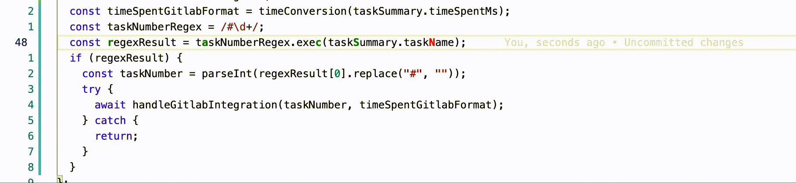

# Vim Find Highlight

this extension is inspired by [vim quick scope](https://github.com/unblevable/quick-scope)

## What does it do?

- For people who use **vim** with vscode. the **find** command is pretty useful to go quickly to a specific word by typing `f [some character in the word]` in normal mode.

- this becomes a problem when there are multiple words in the line that contain the same characters that you use with the find command.

- The main goal of the extension is to **highlight** a character in every word such that when using this character with the **find** command, you reach the word with as minimal steps as possible.

- This isn't always possible if the line contains repeated word. the extension can be configured to color the character with another color to indicate that the word cannot be reached with only one jump
  - ex of such case: `test test`

## Configuration

- The configuration is pretty simple and contains only three parameters
- Go to `settings.json` and set the following

1. ` "vimFindHighlight.charPrimaryColor": "green" // the color that will be used if the word can be reached with one jump`

2. ` "vimFindHighlight.charSecondaryColor": "red" // the color that will be used if the word can not be reached with one jump`

3. ` "vimFindHighlight.charFontWeight": "600" // font weight of the highlighted character`

## Link

[github link](https://github.com/magdyamr542/vim-find-highlight)
